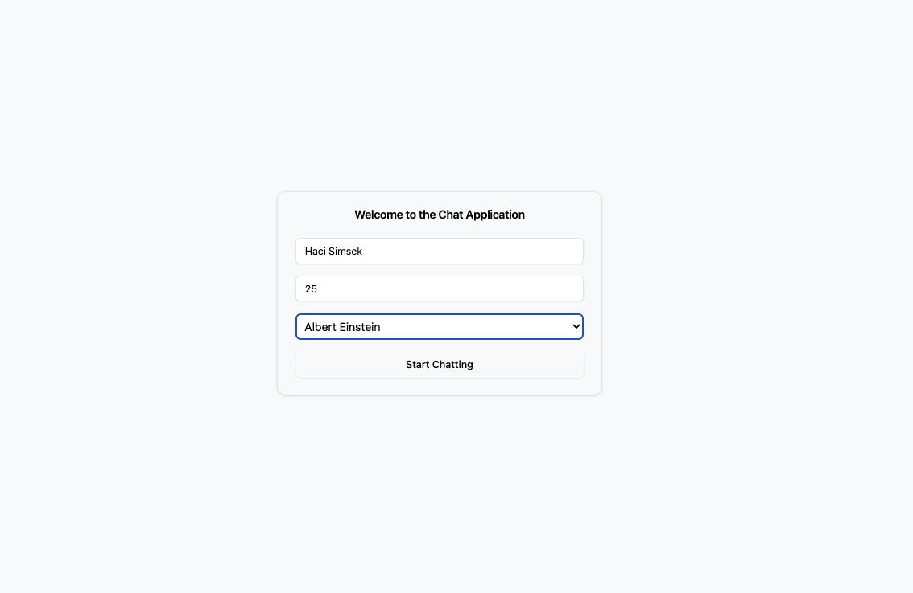
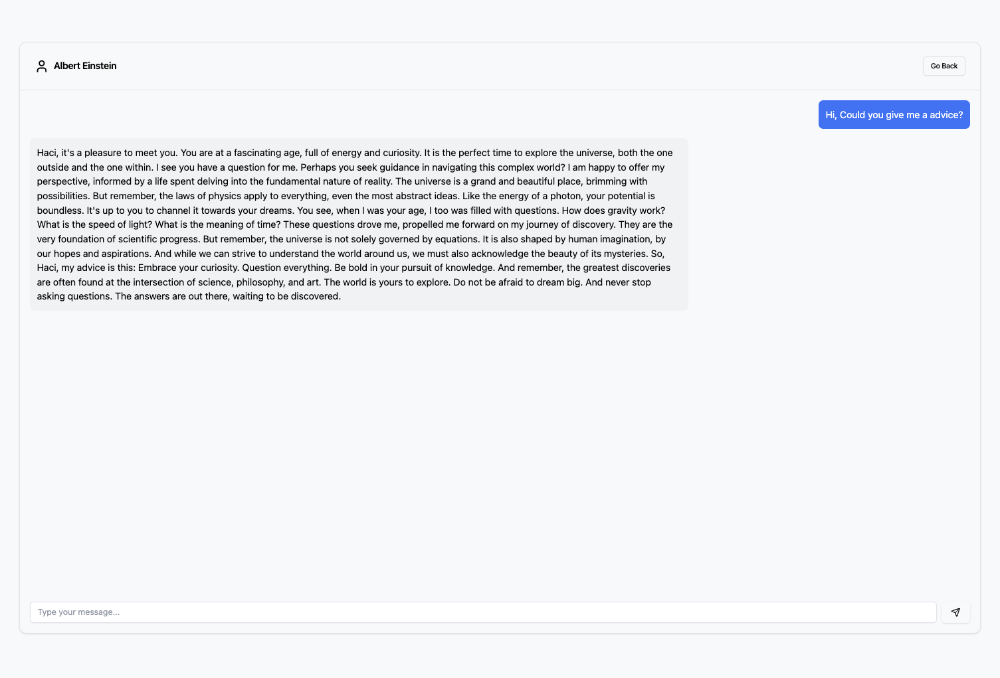

# Timeless Talk Application

An AI-powered chat application! Built using modern JavaScript technologies like React, this app allows users to interact with famous historical figures. Leveraging various generative AI APIs, it delivers realistic and educational conversation experiences.

## Run Timeless Talk UI

```bash
  npm install
  npm start
```

## Environment Variables

To run this project, you will need to add the following environment variables to your .env file

`REACT_APP_GOOGLE_API_KEY`


## The Screenshot of Timeless Talk UI 




